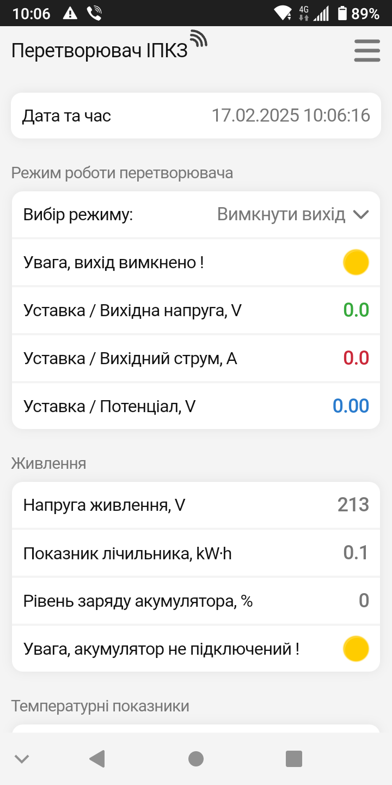
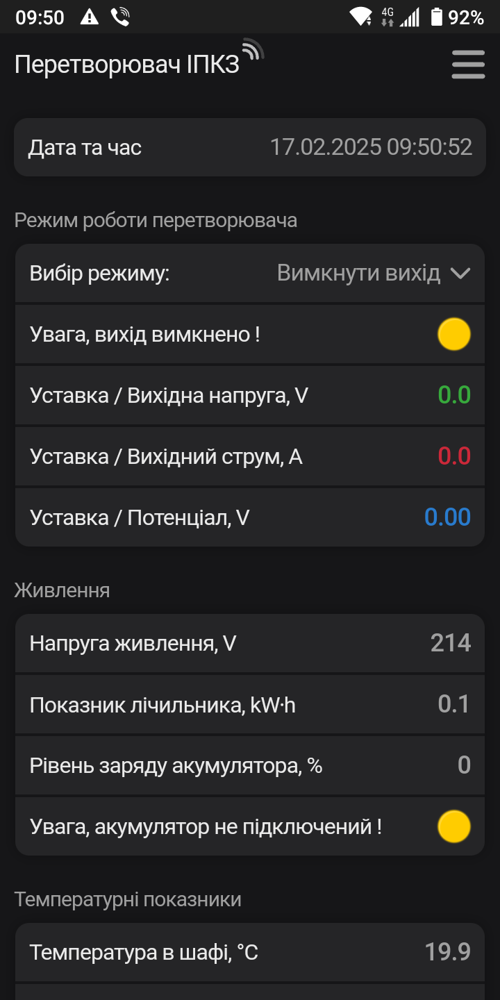

# Веб-інтерфейс перетворювача.
Веб-інтерфейс - це сукупність засобів, за допомогою яких користувач може керувати перетворювачем.

- [x] Доступ з будь-якого пристрою, наприклад, ноутбука, планшета або смартфона.
- [x] Немає прив'язки до конкретного обладнання або операційної системи.
- [x] Немає витрат на придбання та обслуговування обладнання й програмного запезпечення.
- [x] Простота і зручність у використанні.

## Підключення та відключення.
Можна використовувати телефон, смартфон , планшет, ноутбук і т.п.  
Взагалі любий електронний прилад, де є модуль Wi-Fi та браузер *Google Chrome*, *Safari*, *Mozilla Firefox*, *Opera*, *Edge* або інший.

- [ ] Відкрийте дверцята шафи перетворювача.
- [ ] В перетворювачі почне працювати Wi-Fi точка доступу з назвою `IPKZ-XXXXXX`.  
   Де `XXXXXX` - це унікальна послідовність цифр від 0 до 9 та латинських букв від A до F.   
   Для прикладу, назва точки доступу `IPKZ-F2B1D4`.
- [ ] Відкрийте *Налаштування* на Вашому телефоні й підключіться до цієї Wi-Fi мережі `IPKZ-F2B1D4`.    
Мережа відкрита й пароль вводити не потрібно.    
- [ ] Автоматично запуститься браузер й відкриється Веб-інтерфейс перетворювача.
- [ ] Wi-Fi точка доступу перетворювача перестане працювати після закриття дверцят шафи.

!!! warning "Зверніть увагу!"

    - З міркувань безпеки до перетворювача дозволяється підключення тільки **==одного==** електронного приладу.    
    - Інший телефон, планшет або ноутбук при спробі підключення буде проігнорований!   
    - Для підключення іншого приладу потрібно в пепередньо підключеному приладі **==вийти==** з підключеної мережі Wi-Fi.    

## Вибір теми інтерфейсу.
Можна вибрати темну або світлу тему інтерфейсу.

=== "Скріншот світлої теми"  
    { width="300" }

=== "Скріншот темнної теми"
    { width="300" } 

Вибір теми інтерфейсу в три кроки. 

- [ ] Заходимо в системне меню, для цього потрібно клацнути :material-menu:
- [ ] Переключаємо тему, для цього потрібно клацнути на знак напівмісяця :fontawesome-solid-moon:
- [ ] Виходимо з системного меню, для цього потрібно клацнути :material-window-close:

Коротке відео вибору теми інтерфейсу, для збільшення відео натисніть :material-fullscreen:. 

<video controls width="300">
  <source src="../../assets/video/Theme.mp4" type="video/mp4" />Тег video не підтримується вашим браузером.<a href="../../assets/video/Theme.mp4">Скачати відео.</a>
</video>

## Головна сторінка.

=== "Опис головної сторінки"

    На головній сторінці розміщені основні дані перетворювача:   

    - Дата та час перетворювача.   
    - Поточний режим роботи та вихідні параметри.     
    - Показники живлення.   
    - Температурні показники.    
    - Тривалість експлуатації. 

    Тут також є декілька пунктів меню:  

    - Налаштування дати та часу.
    - Зміна режиму роботи.
    - Пункт меню для переходу до *Налаштуваннь*.      

=== "Скріншот головної сторінки"

    { width="300" }  

## Зміна режиму роботи.

Зміна режиму стабілізації та уставок напруги, струму та потенціалу дійснюється на головній сторінці в три кроки:  

- [ ] В пункті *Вибір режиму* зправа потрібно клацнути :fontawesome-solid-angle-down:.
- [ ] У меню, що з'явилося клацніть на потрібний режим роботи.  
- [ ] З'явиться повзунок (слайдер), в якому треба встановити значення уставки.   
      **Перший спосіб.** Потягнути повзунок вліво або вправо, при цьому контролюючи новий показник повзунка.   
      **Другий спосіб.** Клацнути на показник повзунка та ввести нове значення й підтвердити кнопкою *ОК*.   

Коротке відео зміни режиму роботи, для збільшення відео натисніть :material-fullscreen:. 

<video controls width="300">
  <source src="../../assets/video/Theme2.mp4" type="video/mp4" />Тег video не підтримується вашим браузером.<a href="../../assets/video/Theme2.mp4">Скачати відео.</a>
</video>

## Налаштування.

