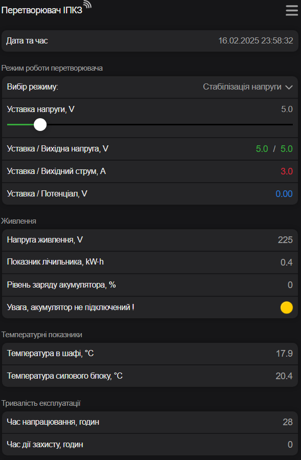
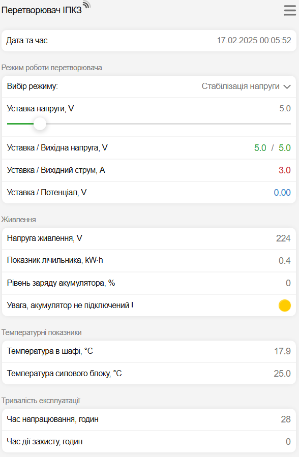

# Веб-інтерфейс перетворювача.
Веб-інтерфейс - це сукупність засобів, за допомогою яких користувач може керувати перетворювачем.  

## Підключення.
Можна використовувати телефон, смартфон , планшет, ноутбук і т.п.  
Взагалі любий електронний прилад, де є модуль Wi-Fi та браузер *Google Chrome*, *Safari*, *Mozilla Firefox*, *Opera*, *Edge* або інший.

1. Відкрийте дверцята шафи перетворювача.
2. В перетворювачі почне працювати Wi-Fi точка доступа з назвою `IPKZ-XXXXXX`.  
   Де `XXXXXX` - це унікальна послідовність цифр від 0 до 9 та латинських букв від A до F.   
   Для прикладу назва точки доступу `IPKZ-F2B1D4`.
3. Відкрийте *Налаштування* на Вашому телефоні й підключіться до цієї Wi-Fi мережі `IPKZ-F2B1D4`.    
Мережа відкрита й пароль вводити не потрібно.    
4. Автоматично запуститься браузер й відкриється Веб-інтерфейс перетворювача.

!!! warning "Зверніть увагу!"

    Для безпеки до перетворювача дозволяється підключення тільки одного телефона, планшета або ноутбука.    
    Інший телефон, планшет або ноутбук при спробі підключення буде проігнорований!   
    Для підключення іншого телефона, планшета або ноутбука потрібно в пепередньо підключеному приладі вийти з мережі Wi-Fi.    

## Зовнішній вигляд.

{ data-title="Темна тема Веб-інтерфейса." }&nbsp;&nbsp;&nbsp;&nbsp;{ data-title="Світла тема Веб-інтерфейса." }