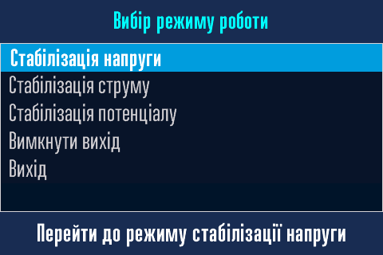

# Ручне керування перетворювачем { #manual-interface data-toc-label='Ручне керування' }

<h1>Увага! Сторінка в процесі наповнення!</h1>

Найкращим засобом локального керування перетворювачем є варіант за допомогою [Веб-интерфейсу.](../web-interface)   
Однак, якщо у вас немає під рукою смартфона/планшета/ноутбука або його батарея розряджена, локальне ручне керування за допомогою ручки енкодера, міні-зумера та дисплея є єдиним варіантом керування.

## Дисплей { #manual-interface-dysplay data-toc-label='Дисплей' }

Перетворювач має вбудований 3,5 дюймовий кольоровий сенсорний TFT LCD дисплей з екраном розміром 73x50 мм. Він зображує поточні параметри перетворювача та їхню зміну при керуванні. Крім того можна, як додаткову можливість, використовувати [сенсорний екран для керування.](#manual-interface-sensor)     

## Міні-зумер { #manual-interface-beeper data-toc-label='Міні-зумер' }

Перетворювач має вбудований міні-зумер. Він допомагає при керуванні перетворювачем сігналізуючи звуковим сигналом про стан керування.

## Енкодер { #manual-interface-encoder data-toc-label='Енкодер' }

Основним органом керування перетворювачем є ручка енкодера.

Енкодери це великий клас пристроїв й вони використовуються в різних галузях.     
В перетворювачі встановлено електромеханічний енкодер з кнопкою. На осі енкодера закріплена ручка, яка і є тим органом управління, що використовується оператором.

За допомогою ручки енкодера можливо виконати три дії:

- [x] Повернути ручку енкодера праворуч.
- [x] Повернути ручку енкодера ліворуч.
- [x] Натиснути на ручку енкодера.

Всі дії при цьому супроводжуються звуковим сигналом міні-зумера. Але цього недостатньо для повноцінного керування, тому були введені деякі особливості натискання ручки, які супроводжуються різним звуковим сигналом.

## Комбінація енкодера, зумера та дисплея для керування { #manual-interface-combination data-toc-label='Як керувати?' }

В тексті далі буде використовуваться наступна лексика та піктограми для операцій з ручкою еенкодера:

- [x] Поворот праворуч :material-rotate-right:. Повернути ручку енкодера праворуч, при цьому лунає дуже короткий звуковий сигнал.
- [x] Поворот ліворуч :material-rotate-left:. Повернути ручку енкодера ліворуч, при цьому лунає дуже короткий звуковий сигнал.
- [x] Коротке натискання :material-clock-time-one-outline:. Коротко натиснути на ручку енкодера й зразу відпустити, при цьому лунає дуже короткий звуковий сигнал. 
- [x] Довге натискання :material-clock-time-three-outline:. Довго, більш ніж на пів-секунди, натиснути на ручку енкодера й відпустити після довгого, пів-секундного, звукового сигналу.
- [x] Дуже довге натискання :material-clock-time-ten-outline:. Дуже довго, більш ніж на дві секунди, натиснути на ручку енкодера й відпустити після двох звукових сигналів, спочатку довгого, пів-секундного, й потім дуже довгого, півтора-секундного, звукового сигналу.

Звучить складно і заплутано, але на практиці все просто, потрібно лише спробувати.

Поворот праворуч :material-rotate-right: та ліворуч :material-rotate-left: використовується для зміни параметрів та навігації по пунктам меню.   
Коротке натискання :material-clock-time-one-outline: використовується для підтверження вибору.  
Довге натискання :material-clock-time-three-outline: використовується для входу в вибір режиму роботи перетворювача.  
Дуже довге натискання :material-clock-time-ten-outline: використовується для входу в налаштування перетворювача та виходу з налаштувань.

Екран дисплея одночасно з тим показує на якому етапі керування або в якому режимі знаходиться перетворювач. Сенсор дисплея використовується, як додаткова можливість керування.

## Режим роботи та сну дисплея { #manual-interface-sleep data-toc-label='Режим роботи та сну' }

Дисплей майже весь час спить. Екран при цьому темний та ніякі дані дисплей не отримує. Він прокидається лише тоді, коли відкривається шафа перетворювача. Він почне отримувати дані та показувати іх на екрані. Після закриття шафи він знову засинає.

## Перша сторінка з логотипом { #manual-interface-logo data-toc-label='Запуск' }

Після ввімкнення живлення на дисплеї з'явиться логотип ТОВ "Технотек" та назва моделі перетворювача. Одночасно з цим дисплей починає отримувати від модуля управління поточні дані про стан перетворювача. 

Через декілька секунд відкриється перша інформаційна сторінка.

## Інформаційні сторінки { #manual-interface-info data-toc-label='Інформація' }

Є дві інформаційні сторінки.   
Перша сторінка відображається протягом 12 секунд.

Друга сторінка відображається протягом 6 секунд. Й далі по колу.

Інформація оновлюється в режимі реального часу.

## Структура сторінки сенсорного екрану { #manual-interface-sensor data-toc-label='Cенсорний екран' }

Всі сторінки дисплея, окрім першої, мають однакову структуру.

- Верхній блок інфрмаційних сторінок використовується для показу анімованого значка Wi-Fi, стану акумулятора й дати та часу.  
  Верхній блок у всіх інших сторінок використовується для назви сторінки. 
- Далі основний блок, тут розміщується інформація, меню, тощо.   
  Основний блок має дві сенсорні зони.   
  Ліва блакитна зона це аналог довгого натискання :material-clock-time-three-outline: ручки.  
  Права жовта зона це аналог дуже довгого натискання :material-clock-time-ten-outline: ручки.  
- Нижній блок сторінки використовується для повідомлень або підказок.

!!! info "Як працювати з сенсорним екраном."
    Команда для сенсорного екрану спрацьовує після натискання з подальшим відпусканням стилуса. На натиск екран не буде реагувати, тілки на натиск з подальшим звільненням стилуса від екрана.

!!! warning "Зверніть увагу!"
    Не використовуйте гострі та тверді предмети в якості стилуса для сенсорного екрану. Рекомендується натискати на екран чимось м'яким. Це може бути, наприклад, деревяна паличка або олівець з гумкою, і натискати не олівцем, а гумкою. Як інший варіант можна надіти на кулькову ручку силіконовий наконечник, вони є в продажу.

## Сторінка вибіру режиму роботи перетворювача { #manual-interface-mode data-toc-label='Вибір режиму роботи' }

## Меню налаштувань перетворювача { #manual-interface-mode data-toc-label='Налаштування' }

## Помилки та попередження перетворювача { #manual-interface-error data-toc-label='Помилки та попередження' }

